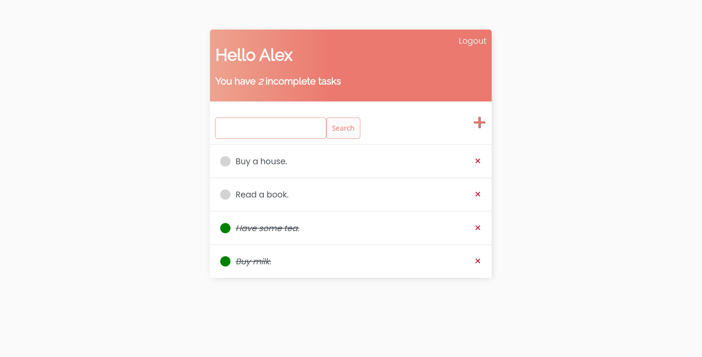

# To Do App



A simple full-stack todo application with registration in python using django.

## Getting started (locally with development server)

Clone the repository.

```bash
git clone https://github.com/GeoCHiP/todoapp.git
cd todoapp/
```

Create and activate a python virtual environment.

```bash
python -m venv .venv
source .venv/bin/activate
```

Install the dependencies.

```bash
pip install -r requirements.txt
```

Create the database.

```bash
python manage.py migrate
```

Run the development server.

```bash
python manage.py runserver
```

